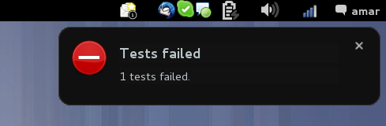

django-aftermath
================

Execute commands after tests are completed.

It requires django-discover-runner package to work. 

Usage
=====

Install using pip: 

`pip install django-aftermath`

In your settings file, add the following required options:

`TEST_RUNNER = 'aftermath.AftermathTestRunner'`

To specifiy a backend, set a dotted path to the backend class:

`AFTERMATH_BACKEND = 'aftermath.backends.NotifySendBackend'`

Currently, there are two backends, `NullBackend` which does nothing (this is the default), and `NotifySendBackend` which uses notify-send to generate notifications. You will have to install notify-send yourself.

On Gnome3, `NotifySendBackend` creates notifications like these:

To specifiy if backend is executed when all test succeed, use `AFTERMATH_RUN_ON_SUCCESS` setting. Default values is `True`.

To specifiy if backend is executed when some tests fail, use `AFTERMATH_RUN_ON_FAIL` setting. Default values is `True`.

Usually, you will only need to specify the first two options. 

If you wish to implement your own backend, take a look at one of the existing backends. All you need is a simple class with `__init__` and `aftermath` functions. If you make one, I'll be happy to include it in the package.

TODO
====

Improve docs/readme.
